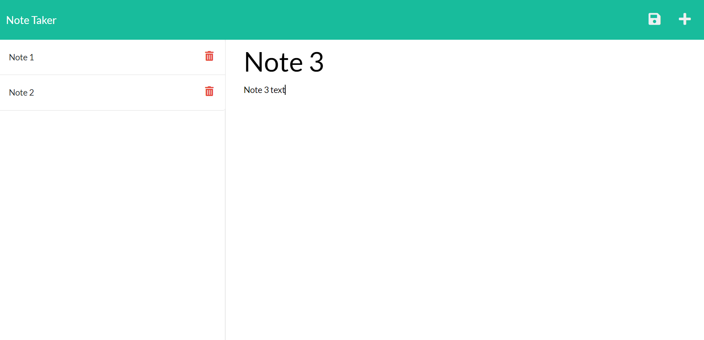

# **Note Taker**

### *Note Taker is a note-taking app tht allows users to take notes by taking a note that they think needs to be note taken. Using express, I implemented a 'faux backend' that passes data back and forth between a json file that represents a database.* 

##  

## Mock Up
  

## Table of Contents 

1. [Installation](#installation)

2. [Usage](#usage)

3. [Contributing](#contributing)

4. [Test](#test)

5. [Questions](#questions)

## Installation 

No install required.
## Usage 

Use this app to take notes. 

## Contributing 

Georgia Tech Coding Boot Camp teaching staff built the index.js and front end of this application, while I built the 'faux backend' using express. 

## Test 

There are no tests in this app.

## Questions 

Email: parkers205@gmail.com 

GitHub: https://github.com/parkersatterfield 

---

## License Information 
APACHE 2.0 (Not really, I am just showing of my README generator app).

            